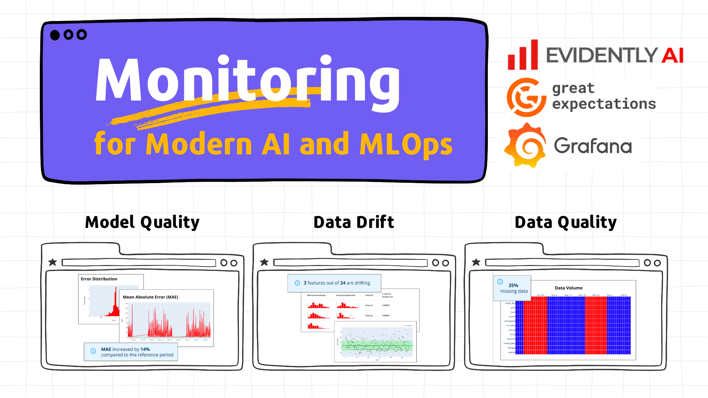

# Monitoring for Modern AI and MLOps Tutorial




This tutorial demonstrates how to monitor machine learning models in production using Evidently and Grafana. It provides a practical example of setting up monitoring for a bike sharing demand prediction model.

## Overview

The tutorial covers:
- Setting up a development environment
- Training a simple ML model
- Implementing model monitoring with Evidently
- Visualizing monitoring metrics in Grafana
- Detecting data drift and model performance degradation

## Prerequisites

- Python 3.8.1+
- Docker and Docker Compose
- Git

## Installation

1. Clone the repository:

```bash
git clone https://github.com/mlrepa/monitoring-for-modern-ai-and-mlops.git
cd monitoring-for-modern-ai-and-mlops
```

2. Create and activate a virtual environment:

```bash
uv venv .venv --python 3.12

# Activate the virtual environment
# On macOS and Linux:
source .venv/bin/activate
# On Windows:
# .\.venv\Scripts\activate
```

> 👉 **Note:** The `uv venv .venv` command creates a virtual environment in a folder named `.venv` within your project directory.

### 3️⃣ Install Dependencies

With the virtual environment activated, install the required Python packages:

```bash
# Install the project with all dependencies
uv sync

# Install development dependencies (optional)
uv sync --extra dev
```

## Project Structure

```text
.
├── data/              # Data directory
├── models/            # Trained models
├── notebooks/         
│   ├── 1-evidently-getting-started.ipynb
│   ├── 2-monitor-ml-model.ipynb
│   └── 3-grafana-getting-started.ipynb
├── src/               
│   └── load_data.py
├── docker-compose.yaml
├── pyproject.toml
└── README.md
```

## Getting Started

1. Load data:

Load data from [https://archive.ics.uci.edu/ml/
datasets/bike+sharing+dataset](https://archive.ics.uci.edu/ml/datasets/bike
+sharing+dataset) to the `data/` directory

```bash
python src/load_data.py
```

2. Start the monitoring stack:

```bash
docker-compose up -d
```

The following services will be started:

- *monitoring-db*: monitoring database (PostgreSQL) - for collecting model 
metrics
- *grafana*: a service (tool) for visualizing metrics

Navigate to Grafana UI on [http://localhost:3000](http://localhost:3000) in 
your browser. The default credentials are `admin/admin`

### 3. Open `tutorial.md` and run the notebooks in order:

- `1-evidently-getting-started.ipynb`: Introduction to Evidently
- `2-monitor-ml-model.ipynb`: Setting up model monitoring
- `3-grafana-getting-started.ipynb`: Visualizing metrics in Grafana

## Contributing

Contributions are welcome! Please feel free to submit a Pull Request.

## License

This project is licensed under the MIT License - see the LICENSE file for details.

## Acknowledgments

- Dataset: [UCI Bike Sharing Dataset](https://archive.ics.uci.edu/ml/datasets/bike+sharing+dataset)
- Evidently: [https://www.evidentlyai.com/](https://www.evidentlyai.com/)
- Grafana: [https://grafana.com/](https://grafana.com/)
